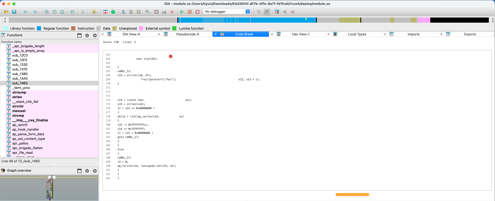

# ida-break

gpt‑5.3‑codex wrote a break game, playable in IDA Pro.

I plan to keep updating it.

I got the idea from <a href="https://github.com/johngrib/vim-game-code-break">vim-game-code-break</a>

## Usage

`CTRL+ALT+B`
